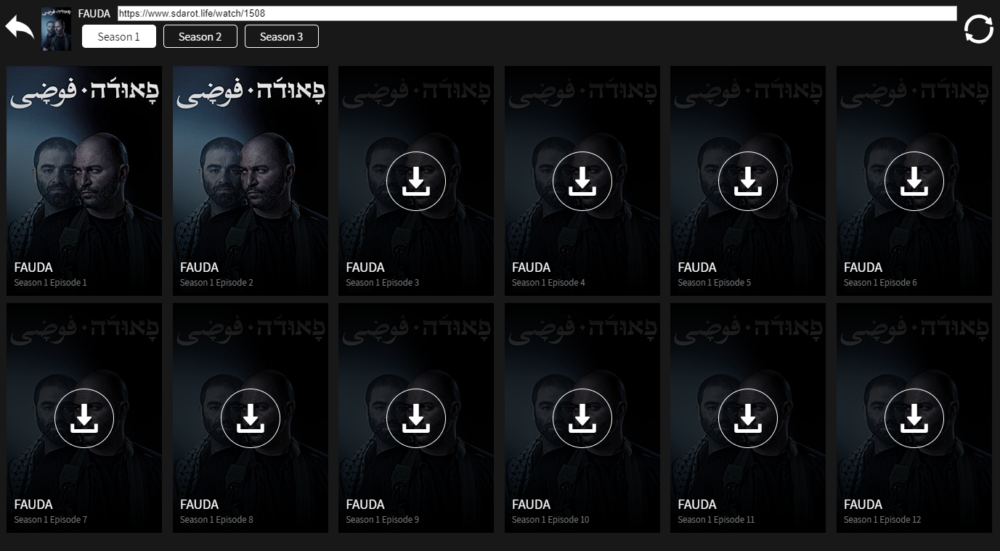

# Sdarot downloader

download any show from sdarot website!




### HOW TO LAUNCH
Install requirements:
```
python -m venv venv
./venv/Scripts/activate
pip install -r requirements.txt
yarn install
```

Configure env variables of rabbitmq server:
```
$ENV:RABBIT_SERVER="domain"
$ENV:REDIS_SERVER="domain"
$ENV:USERNAME="username"
$ENV:PASSWORD="password"
```

SERVER variable should be a dns to server containing `redis` service and `rabbitmq` service.

terminal 1 - celery worker:  
```
cd backend
celery -A sdarot_downloader.v2_index.celery worker -c 4 -n worker1@%h -P gevent
```

terminal 2 - server:  
```
cd backend
python -m sdarot_downloader.v2_index
```

terminal 3 - webpack server:
```
npx webpack-dev-server --config webpack.dev.config.js
```